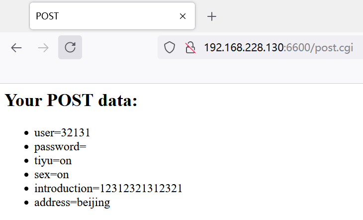

#### 1、准备工作

进入`httpdocs`，给`.html`和`.cgi`文件权限

```powershell
xm@xmServer:~/WebServer$ cd httpdocs/
xm@xmServer:~/WebServer/httpdocs$ sudo chmod 600 test.html 
[sudo] password for xm: 
xm@xmServer:~/WebServer/httpdocs$ sudo chmod 600 post.html 
xm@xmServer:~/WebServer/httpdocs$ sudo chmod +X post.cgi 
```

回到根目录，`make`，然后运行编译好的可执行文件开启服务，`./myhttp`

```powershell
xm@xmServer:~/WebServer/httpdocs$ cd ..
xm@xmServer:~/WebServer$ ls
httpd.c  httpdocs  image  Makefile  README.md
xm@xmServer:~/WebServer$ make
gcc -W -Wall -o myhttp httpd.c -lpthread
xm@xmServer:~/WebServer$ ls
httpd.c  httpdocs  image  Makefile  myhttp  README.md
xm@xmServer:~/WebServer$ ./myhttp 
```

#### 2、文件目录及操作过程

`httpdocs`中的`test.html`，在访问默认路径时会跳转过来，如下图：


请求`post.html`如下：


点击`提交`后，会向服务器请求`post.cgi`页面，服务器接到请求，解析报文之后，调用`execute_cgi`文件处理接收到的数据，在`post.cgi`脚本中把接收到的数据拼接起来，最后`html`给浏览器显示。


#### 3、整体框架图


#### 4、参考

参考阿秀的项目：https://github.com/forthespada/MyPoorWebServer
